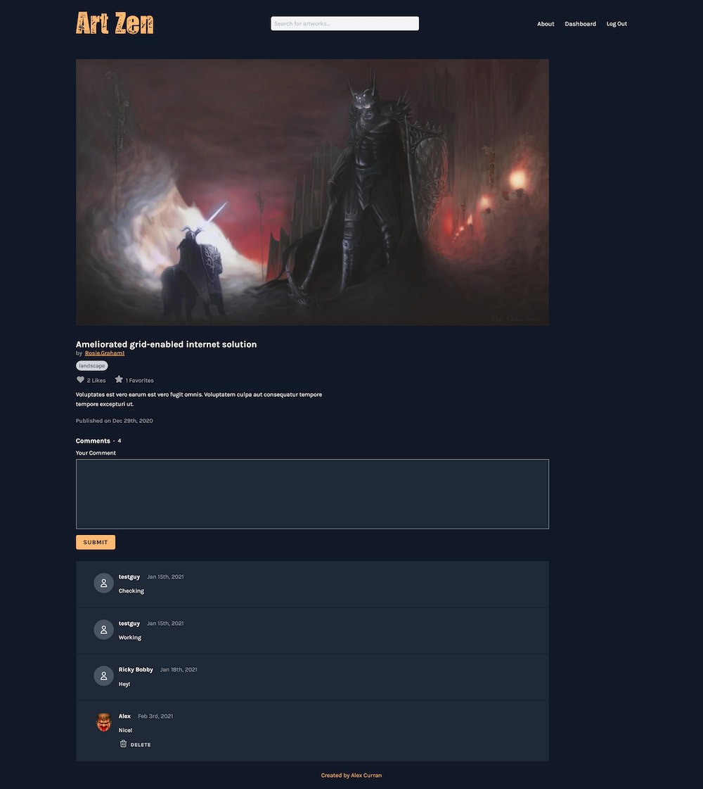

# Art Zen (social media art site)

[View live site](https://apcurran-art-zen.herokuapp.com/)

## Features:

- Sign up and log in user functionality

- Access to a user dashboard with a multitude of functionality, inluding:

    - Edit user profile information, or upload a unique avatar img

    - Upload artworks which include an image, title, description, and genre

    - Add favorite artworks or delete them from your stored favorites

    - View your subscriptions feed

    - Manage your artwork pages (ability to view or delete)

- Artwork pages include an image, title, genre, associated username (with link to the user profile), likes button, and favorites button

- Ability to comment, or delete a previously created comment, on an artwork page

- Main "Discover" page lists newly created artworks by date and offers a way to view/interact in a visually pleasing masonry grid layout

- Ability to follow a specific user whose work you enjoy

- Image uploads utilize Cloudinary as a fast, third-party image CDN

- :test_tube: Cypress.io automated testing for E2E tests

